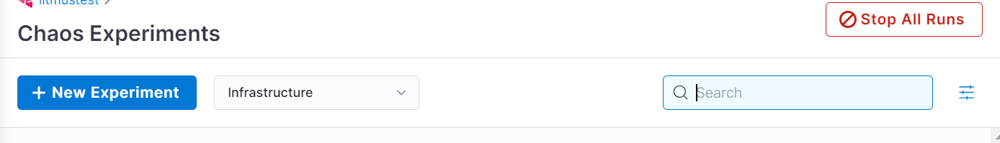
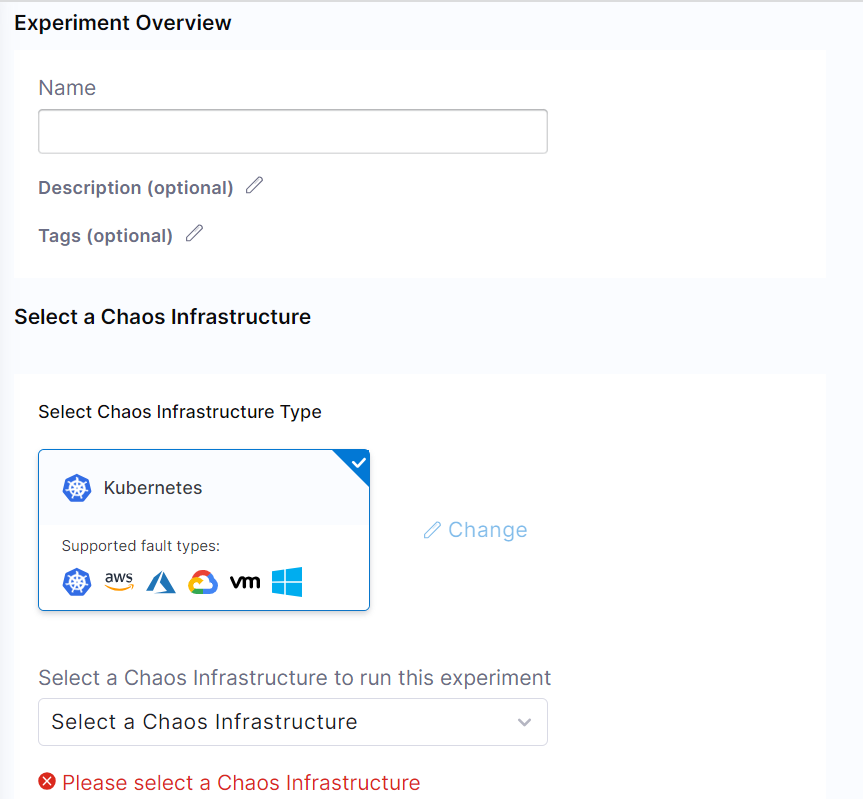
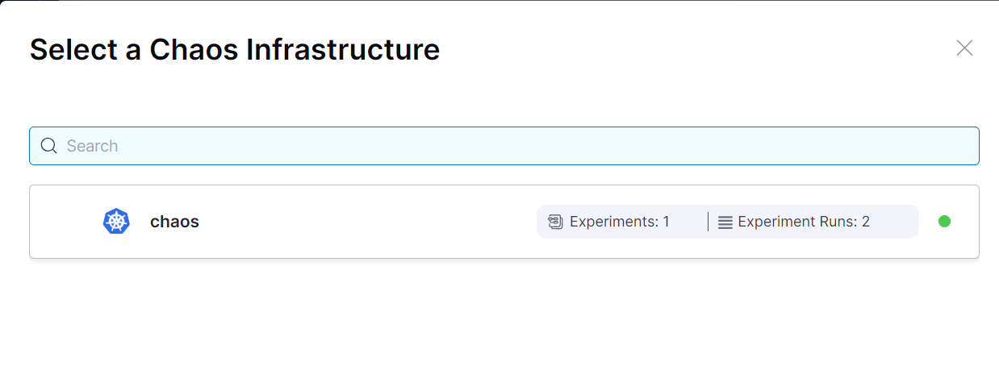
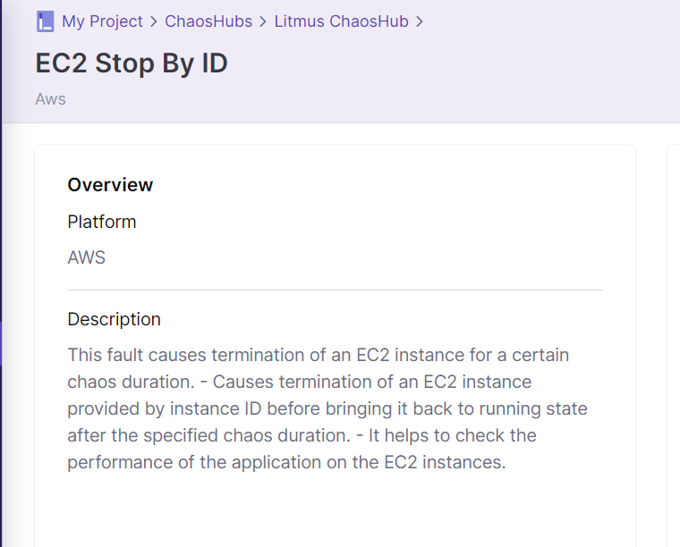
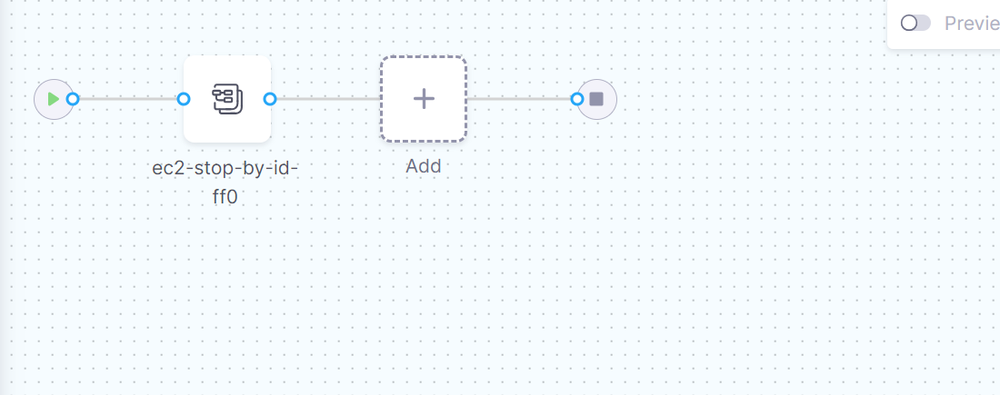
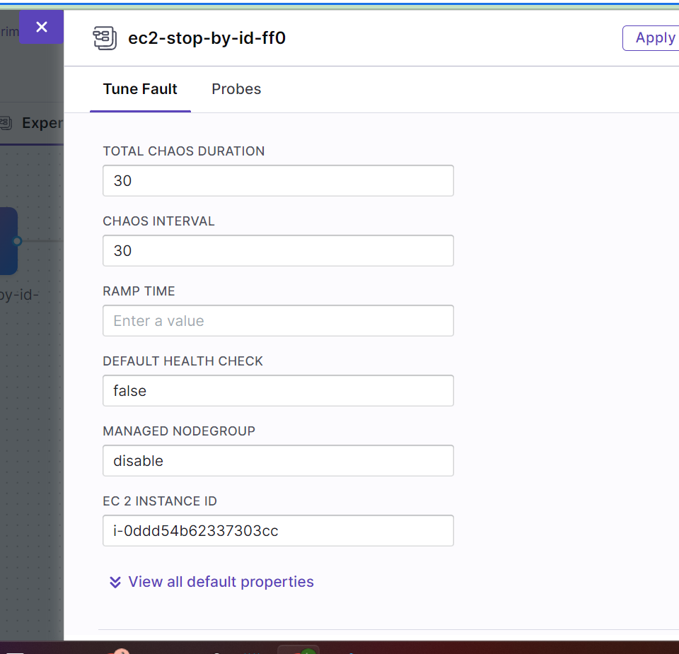

### Step 1. Create new experiment
 

 

### Step 2. Choose chaos infra
 

 

### Step 3. Choose template from chaoshub 
 

 

 

### Step 4. Add cloud-secret in litmus namespace (for access aws resources)

link : https://litmuschaos.github.io/litmus/experiments/categories/aws/ec2-terminate-by-id/

### Step 5. Run workflow

