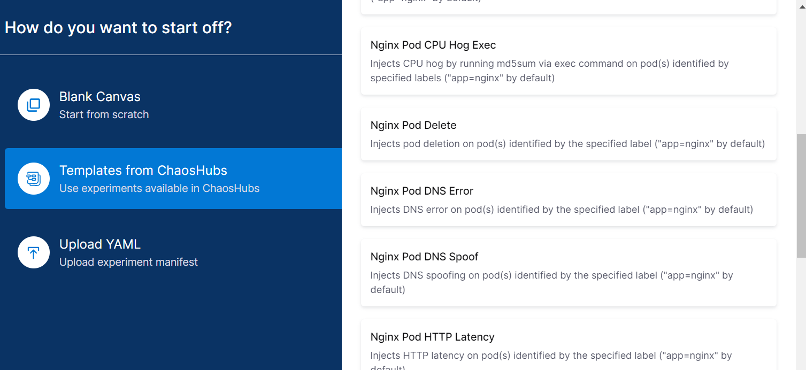
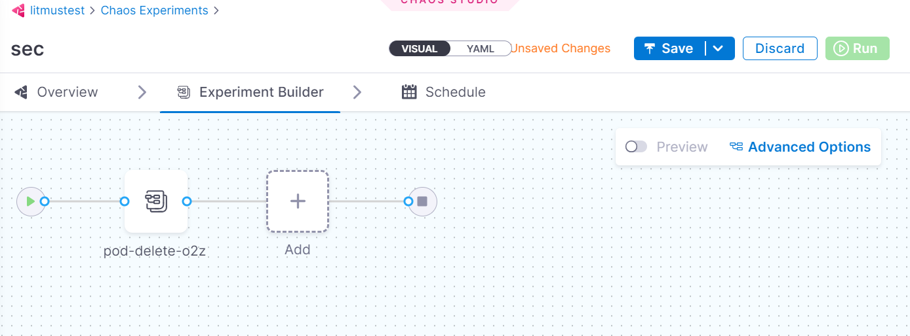
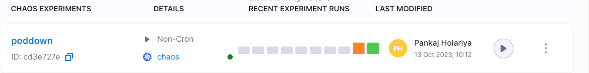

### Step 1. Create new experiment

 

### Step 2. Choose chaos infra
 

 

### Step 3. Choose template from chaoshub
 

 

### Step 4. Setup and save workflow
 

 

### Step 5. Run workflow 
 
    
